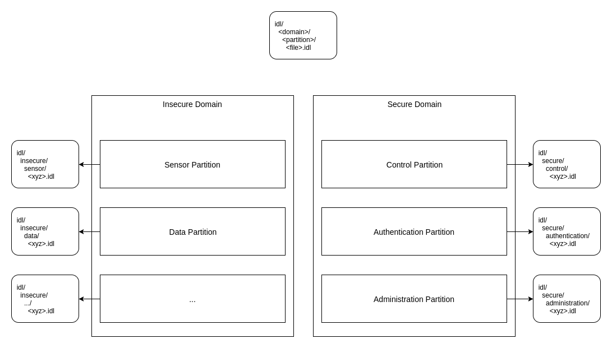

# home-network
Sandbox of things to communicate with the devices around my house.

## TODO

- move common cmake things into the top-level file (https://rix0r.nl/blog/2015/08/13/cmake-guide/)

## Partitioning
TODO

